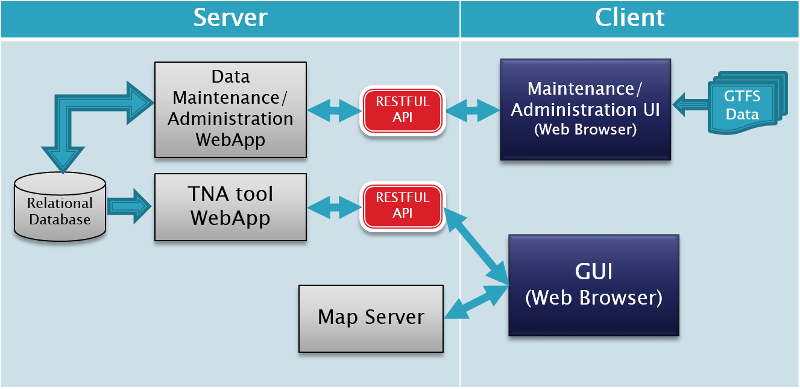

Software Architecture
=========

The Transit Network Analysis Software (TNAST) is a web application and uses a client-server architecture. The architecture of the TNAST is displayed in the picture below. 

Client Side Application
---------

The client side application has a Graphical User Interface (GUI) that displays information to the user, processes user requests, and sends them to the server side application. The client side application was developed in HTML and Javascript. Javascript libraries such as Leaflet, jQuery, jQuery-ui, jQurey-ui dialogextend, jQuery-ui markercluser, and DataTables were also used in the development of the GUI.

Server Side Application
---------

The server side application is responsible for storing, processing, and providing information to the client side application. The server side application was written in Java. PotgreSQL and PostGIS have been used as the relational database engine. Hibernate and Hibernate spatial libraries have been used to interface the server side application with the database.
