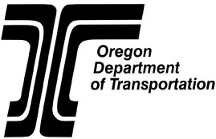
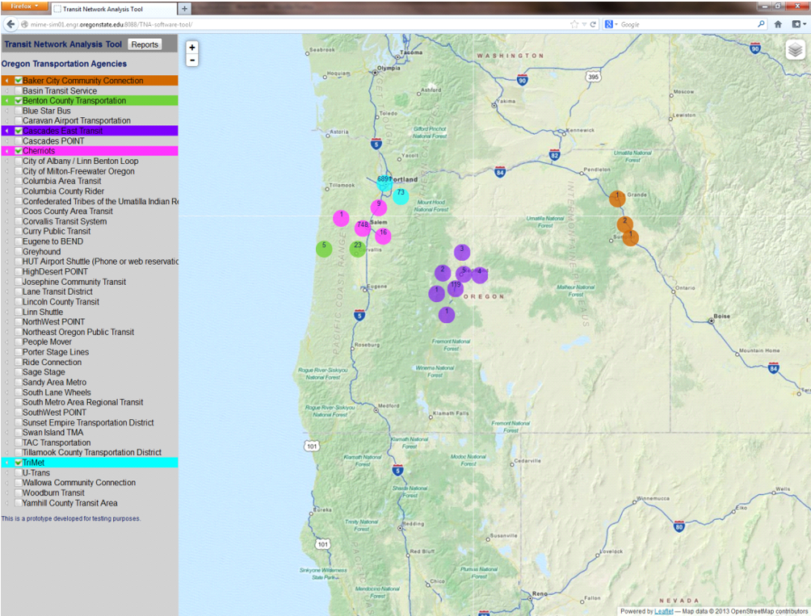

Project History
=========

Assessing the current "state of health" of individual transit networks is a fundamental part of studies aimed at planning changes and/or upgrades to the transportation network serving a region. To be able to effect changes that benefit both the individual transit networks as well as the larger transportation system, organizations need to develop meaningful strategies guided by specific performance metrics. A fundamental requirement for the development of these performance metrics is the availability of accurate data regarding transit networks.

Prior to 2005, transit data was not readily available. This situation complicated the assessment of single transit networks, let alone performing a state-wide or region-wide study. The advent of the [General Transit Feed Specification](https://developers.google.com/transit/gtfs) (GTFS) changed this constrained landscape and motivated transit operators to release their schedules and route information to third party developers.

The [Research Unit](http://www.oregon.gov/ODOT/TD/TP_RES/Pages/Research-Program-2.aspx "Research Unit") of the [Oregon Department of Transportation](http://www.oregon.gov/ODOT "Oregon Department of Transportation") (ODOT) provided the funding to develop the open source, web-based Transit Network Explorer Tool (TNExT). The [Rail and Public Transit Division](http://www.oregon.gov/ODOT/PT) (RPTD) of ODOT and Oregon State University collaborated in the definition of the functional and technical specifications of the software tool.
 
 

Phase I
-------
The first phase of the project was titled 'Proof of Concept: GTFS Data as a Basis for Optimization of Oregon's regional and statewide Transit Networks'. The software development efforts spanned from July 2012 until September 2013. In this phase, a review was conducted on currently available software packages that perform some form of Transit Network Explorer. These packages varied largely in terms of the software platforms they are built upon, as well as the analysis capabilities they offer. A total of 43 software packages in different areas related to the analysis of transit networks were identified and analyzed based on the following criteria:

 * Be capable of collecting and storing GTFS data. 
 * Be capable of keeping GTFS data up-to-date.
 * Allow the visualization of GTFS data on a map. Desirable features of this capability may include: displaying stops, routes, transit agency information and other information provided on a map; allowing the user to select what feed/feeds to display; and providing a web-based interface.
 * Be capable of generating different kinds of reports based on queries from GTFS data.
 * Be developed using open source tools.

The conclusion reached from this analysis was that only OpenTripPlanner met most of the criteria discussed before and provided the best balance between already available features and required development work.

 

The final product, referred to as the Transit Network Explorer Tool (TNExT), incorporates publicly available transit data and census data as its main inputs and can be used to visualize, analyze and report on the Oregon transit network. 

NOTE: The final report of Phase I of the project can be accessed via the [ODOT](http://www.oregon.gov/ODOT/TD/TP_RES/docs/ProjectWorkPlans/SPR752WP.pdf) page.

Phase II
-------
The second phase of the project is titled "An Open Source Tool For The Visualization, Analysis And Reporting of Regional And Statewide Transit Networks". The software development efforts in Phase II spanned from November 2013 until December 2014. Since the prior version of the TNAST developed in Phase I could no longer accommodate the new project requirements, a new version of the TNAST was developed from scratch using open source development tools and platforms. 

Phase III
-------
The third phase of the project is titled "Phase III: An Open Source Tool for the Visualization, Analysis, and Reporting of Regional and Statewide Transit Networks". The software development efforts in Phase III spanned from January 2015 until March 2016. The main focus of Phase III has been on further advancing the functionality of the TNAST and on integrating transit data (i.e., GTFS data) with other data sources such as population, demographics, park & ride, and employment.